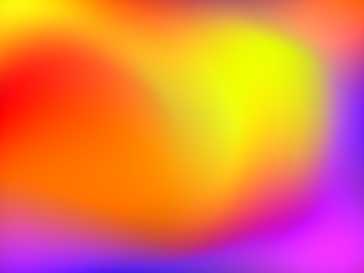
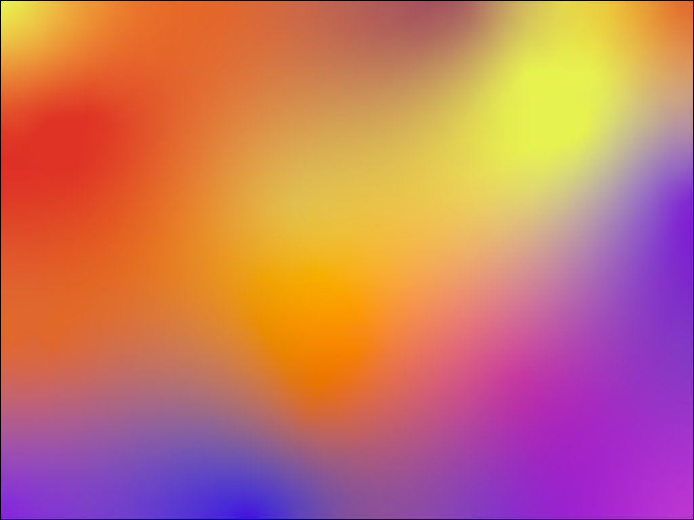
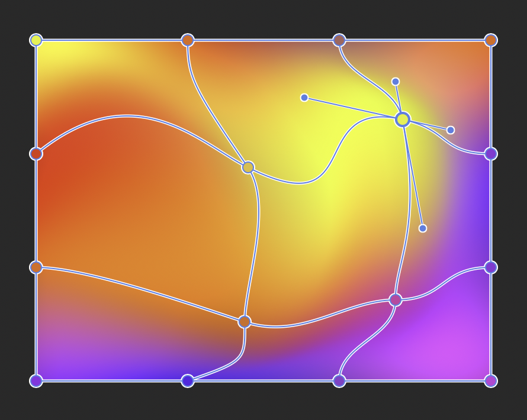
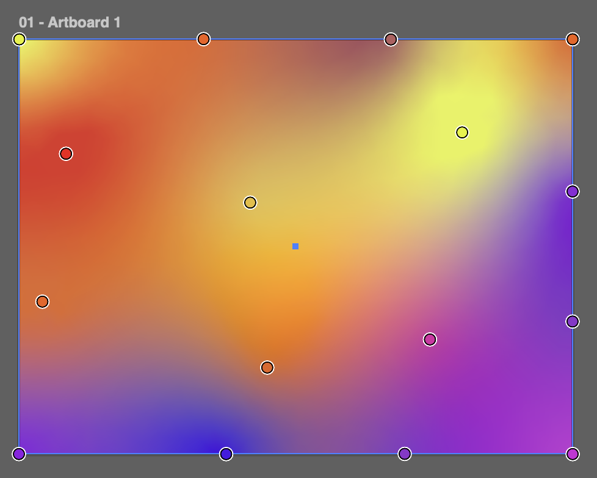

# Explainer: 2D gradients

This document summarises the collective design work on 2D gradients in [CSSWG GitHub issue#7648](https://github.com/w3c/csswg-drafts/issues/7648).

> [!NOTE]
> If the proposal is approved by the CSSWG, I will move this explainer to the csswg-drafts GitHub repository.

## Authors:

- Josh Tumath (BBC)

> [!NOTE]
> The 2D gradients proposal has been a collaborative effort by various CSSWG members and contributors. See the References & acknowledgements section.

## Participate

[CSSWG GitHub issue#7648](https://github.com/w3c/csswg-drafts/issues/7648)

## Table of Contents

<!-- START doctoc generated TOC please keep comment here to allow auto update -->
<!-- DON'T EDIT THIS SECTION, INSTEAD RE-RUN doctoc TO UPDATE -->

- [Introduction](#introduction)
- [User-Facing Problem](#user-facing-problem)
  - [Goals](#goals)
- [Proposed Approach](#proposed-approach)
  - [`mesh-gradient()`](#mesh-gradient)
  - [`freeform-gradient()`](#freeform-gradient)
  - [Comparison of mesh and freeform gradients](#comparison-of-mesh-and-freeform-gradients)
  - [Solving PDF serialisation](#solving-pdf-serialisation)
- [Alternatives considered](#alternatives-considered)
  - [Define mesh gradients in SVG instead](#define-mesh-gradients-in-svg-instead)
  - [A choice of colour interpolation algorithms](#a-choice-of-colour-interpolation-algorithms)
- [Accessibility, Internationalization, Privacy, and Security Considerations](#accessibility-internationalization-privacy-and-security-considerations)
- [References & acknowledgements](#references--acknowledgements)

<!-- END doctoc generated TOC please keep comment here to allow auto update -->

## Introduction

CSS provides support for 1D gradient images (meaning the colour stops are defined on one axis) such as `linear-gradient` and `radial-gradient()`. This proposal specifies two image functions for authors to specify 2D gradients in CSS:

`mesh-gradient()` – the author specifies a 2D grid of colour stops and manipulates the positions of the stops



`freeform-gradient()` – the author specifies colour stops wherever they would like on a gradient box; it is based on a type of gradient in Adobe Illustrator



## User-Facing Problem

2D gradients have become a popular design choice. They are used extensively in many modern brand designs.

Currently, the only way for authors to use any kind of 2D gradient on the web is by pre-rendering them in a image design application. There are not many free or open source applications that can produce them. Adobe Illustrator and Canva Affinity are the most popular tools for producing mesh gradients. Only Adobe Illustrator can produce freeform gradients.

### Goals

- It should be possible to serialise 2D gradients into PDF documents so that they are reproducible in print formats

<!--
### Non-goals

[If there are "adjacent" goals which may appear to be in scope but aren't,
enumerate them here. This section may be fleshed out as your design progresses and you encounter necessary technical and other trade-offs.]
-->

<!--
## User research

[If any user research has been conducted to inform the design choices presented,
discuss the process and findings.
We strongly encourage that API designers consider conducting user research to
verify that their designs meet user needs and iterate on them,
though we understand this is not always feasible.]
-->

## Proposed Approach

There are two proposed new `<gradient>` type functions.

### `mesh-gradient()`

A mesh gradient is created by specifying a 2D grid of colour stops across the gradient box. Each cell in the grid is called a patch.

To render the a mesh gradient, the user agent interpolates the colours defined in the colour stops at the corners of each patch; typically using a _coons patch_ or _tensor-product patch_.

The following image is an example of a mesh gradient being edited in Affinity. It demonstrates the grid vertices and the bezier curve control points associated with a colour stop.



Mesh gradients have a complex set of data points. I expected authors will prefer to define them using a design tool rather than handwrite them.

The proposed API is designed by Tab Atkins-Bittner, improving on a previous design by Amelia Bellamy-Royds. The syntax definition is:

```
mesh-gradient( [ <color-interpolation-method> || <color> ]?,
               <mesh-point># [ ';' <mesh-point># ]*
             )
<mesh-point> = <color> [ <mesh-absolute-position> | <mesh-relative-position> ]?
<mesh-absolute-position> = <position> [ with <position> [ / <position> ]{0,3} ]?
<mesh-relative-position> = by <coordinate-pair> [ with <mesh-relative-control-point> [ / <mesh-relative-control-points> ]{0,3} ]?
<mesh-relative-control-point> = <coordinate-pair> [from origin]?
```

The syntax defines the grid in rows. Each colour stop is separated by a comma (`,`) and row is separated by a semicolon (`;`). The colour stops use the same positioning syntax as `background-position`. The bezier control points are specified after the slash (`/`). Like with other gradients, the author can specify the colour interpolation method.

The simplest example of a mesh gradient using this syntax is:

```css
background-image: mesh-gradient(red, blue; green, yellow);
```

In this example, there is one patch defined with the colours at each corner.

A more complex example is:

```
background-image: mesh-gradient(
  in oklab,

  cyan 0cm 0cm,
  magenta by 5cm 0cm with 1cm 0cm / 4cm 0cm;

  yellow by 0cm 5cm with -1cm 0cm from origin,
  black by 5cm 5cm with 0cm -1cm / -1cm 0cm
);
```

### `freeform-gradient()`

A freeform gradient is created by specifying colour stops made from points or lines at any arbitrary position on the gradient box. Each colour stop can have a spread value, which represents how much weight or dominance the colour has over other colours when they are interpolated.

To render the freeform gradient, the user agent can do a Delauney triangulation to produce a mesh using the colour points and then interpolate the intermediate colours.

> [!NOTE]
> The term _freeform gradient_ was coined by Adobe and isn't a commonly used term outside of the Adobe ecosystem. They are not a clearly defined and well established concept like mesh gradients. No other graphics editing application can create them.
>
> This proposal seeks to replicate the capability of Adobe's implementation of freeform gradients. However, we can bikeshed a different name.

The following image is an example of a freeform gradient being edited in Adobe Illustrator. It demonstrates 16 colour stops placed in roughly the same locations as the mesh gradient example above, but the result is very different. A couple of the colour stops have had their spread value increased by a small amount.



Freeform gradients are simple for authors to define, because they can place colour stops arbitrarily. Therefore, the proposed CSS syntax should also be simple for authors to write by hand without tooling.

The proposed API was designed with help from Sebastian Zartner, Lea Verou, Bramus and Tab Atkins-Bittner. The syntax definition is:

```
freeform-gradient( <color-interpolation-method>? , <freeform-point># )
<freeform-point> = <color> <number>? <position>+
```

The syntax lists each colour stop with a number representing the spread value and position. The author can optionally list multiple positions to form a line.

The simplest example of a freeform gradient using this syntax is:

```css
background-image: freeform-gradient(red top left, yellow bottom right);
```

To make a colour stop that is a line rather than a single point, the author can list multiple positions:

```css
background-image: freeform-gradient(
  red top left,
  yellow bottom left bottom right top right
);
```

### Comparison of mesh and freeform gradients

Mesh gradients are a well known type of gradient in computer graphics. They were first introduced in Adobe Illustrator 8.0 in 1998 and were later supported in other graphics applications; whereas freeform gradients were introduced only in Adobe Illustrator 23.0 in 2018 and do not exist in other image editing applications (as far as I know).

Unlike freeform gradients, mesh gradients are supported in many graphics libraries including Skia, SwiftUI and Android UI (but they do not out-of-the-box allow developers to select different colour space interpolations).

Freeform gradients have a much simpler API than mesh gradients, so they would be much easier for authors to write in CSS by hand without using tooling.

They both produce different types of 2D gradients. Generally, mesh gradients can't reproduce a complex freeform gradient, and visa versa.

### Solving PDF serialisation

The PDF specification ISO 32000-2 section 8.7.4.5.8 defines tensor-product patch mesh shadings which can be used to represent both mesh gradients and freeform gradients with bicubic colour interpolation.

The CSS colour interpolation method can also supported in PDFs. This is done by providing a function for custom colour interpolation.

The issue includes [further discussion on PDF serialisation.](https://github.com/w3c/csswg-drafts/issues/7648#issuecomment-4807416203)

However, some PDF viewers have low quality support for coons patch and tensor-product patch shadings, which can cause strange rendering artifacts including patches overlapping incorrectly or gaps where the patches join. We hope that, if 2D gradients become more popular, PDF implementations will improve the quality of their patch shading renders.

## Alternatives considered

<!-- [This should include as many alternatives as you can,
from high level architectural decisions down to alternative naming choices.
If you capture your alternatives as Architectural Decision Records,
use this section to link to the ADRs.] -->

### Define mesh gradients in SVG instead

The SVG Working Group had proposed a `MeshGradient` element and related elements for SVG 2, but these were removed from the draft specification in 2018.

#### Pros

- Mesh gradients are complex and therefore might be too complex to represent in CSS functions; it may be easier for authors to comprehend them in a markup language

#### Cons

- Representing mesh gradients in SVG means they can't easily be used with CSS custom properties and other CSS features
- The SVGWG are not currently pursuing mesh gradients

#### Reason for rejection

Recent suggestions by contributors to the SVGWG and CSSWG have shown that it is possible to make a CSS-style functional notation to create mesh gradients in CSS.

I think we are willing to accept that the CSS function will still appear complex to authors when defining very detailed gradients, and we can still provide the freeform gradient function if authors want a simpler hand-written option. We make the simple things easy and the complex things possible.

### A choice of colour interpolation algorithms

Mesh gradient implementations typically provide either bilinear or bicubic colour interpolation. We could let authors choose which one they would like.

#### Pros

- Authors get greater control over how mesh gradients are rendered

#### Cons

- Bilinear looks ugly because the edge of each patch is often visible; bicubic better blends the colours between the vertices
- Authors will need to understand the effects of bilinear vs bicubic

#### Reason for rejection

I don't think authors will ever want to use bilinear, so this proposal only uses bicubic. If we do find a reason why authors would want bilinear, we can make it an optional argument in the API and make bicubic the default.

Notably, SwiftUI's mesh gradient API makes bicubic the default.

## Accessibility, Internationalization, Privacy, and Security Considerations

As with the existing types of image gradients, authors should be careful not to cause text colour contrast issues with 2D gradients.

<!-- ## Stakeholder Feedback / Opposition

[Implementors and other stakeholders may already have publicly stated positions on this work. If you can, list them here with links to evidence as appropriate.]

- [Implementor A] : Positive
- [Stakeholder B] : No signals
- [Implementor C] : Negative

[If appropriate, explain the reasons given by other implementors for their concerns.] -->

## References & acknowledgements

So many members and contributors to the CSSWG have been involved in the research and feedback for this proposal, whom I am incredibly grateful to. This has truly been a collaborative piece, with very little of the work my own. Many thanks for valuable feedback and advice from:

- Amelia Bellamy-Royds for mesh gradient expertise and opinions and the initial proposal for the mesh gradient function syntax
- Bramus for doing a lot of research and creating an AI-generated prototype tool that was incredibly helpful in understanding implementation support and exploring API proposals
- Chris Lilly for explaining how freeform gradients can be rendered and for general advice and support
- Lea Verou for improving on the freeform gradient syntax
- Mike Bremford (faceless2) for sharing the SVG2 `MeshGradient` proposal and for general PDF expertise
- Sebastian Zartner for helping to define the freeform gradient syntax and investigating PDF viewer support for mesh gradients
- Tab Atkins-Bittner for proposing a more CSS-style API for defining mesh gradients and for general advice and feedback

(If anyone is missing from this list, please let me know and I will add you.)

Thanks to the following proposals, projects, libraries, frameworks, and languages
for their work on similar problems that influenced this proposal.

- [SVG2 2015: Mesh gradients](https://www.w3.org/TR/2015/WD-SVG2-20150409/pservers.html#MeshGradients)
- [SwiftUI: Mesh gradient](https://developer.apple.com/documentation/swiftui/meshgradient)
- [Android UI: Mesh gradient](https://developer.android.com/develop/ui/compose/graphics/draw/mesh-gradient)
